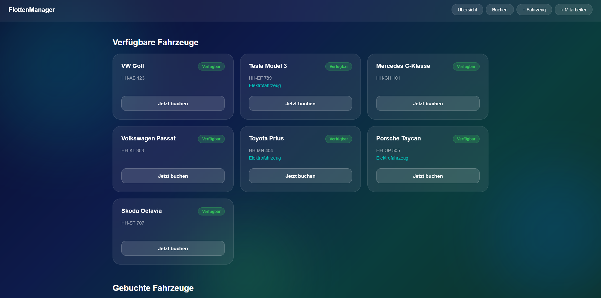
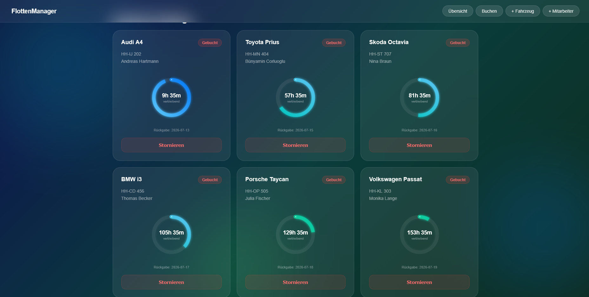
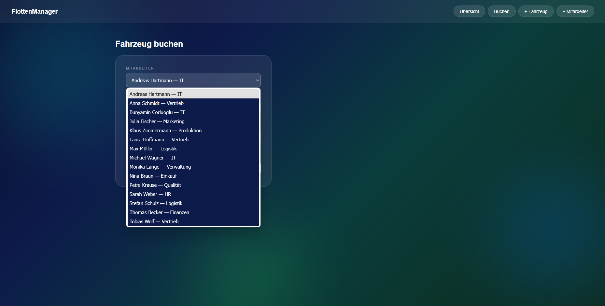
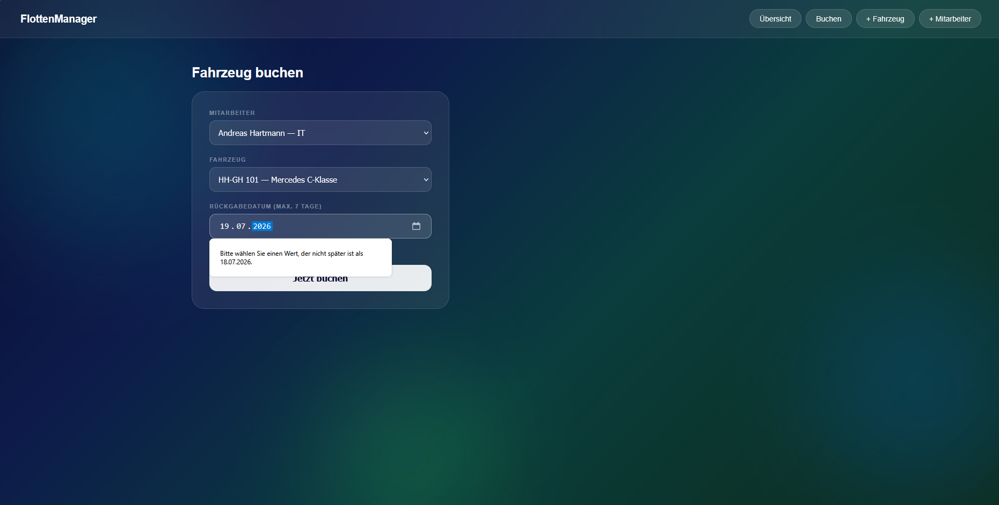

# FlottenManager 🚗

Ein vollständiges Java Full-Stack-Projekt zur Verwaltung einer Unternehmensflotte — von der Datenbank über die Backend-Logik bis zur Web-Oberfläche. Eigenständig entwickelt neben meiner Umschulung zum Fachinformatiker für Anwendungsentwicklung (FIAE, IHK) bei der GFN GmbH in Hamburg, um erlernte Konzepte praktisch anzuwenden und zu vertiefen.

## 🎯 Über das Projekt

FlottenManager bildet einen realen Geschäftsprozess ab: Mitarbeiter buchen Firmenfahrzeuge, das System überwacht Verfügbarkeit, Buchungsfristen und Rückgabezeitpunkte vollautomatisch. Im Zentrum steht dabei nicht nur die Funktion, sondern auch die Erfahrung — die Web-Oberfläche wurde eigenständig im modernen Glassmorphism-Design gestaltet, mit transparenten Flächen, weichen Farbverläufen und animierten SVG-Kreisbalken, die in Echtzeit anzeigen, wie viel Zeit einer Buchung noch verbleibt. Technisches Können und visuelles Gespür verbinden sich hier zu einer Anwendung, die nicht nur zuverlässig funktioniert, sondern auch Freude macht, sie zu benutzen.

Eigenständig entwickelt neben meiner Umschulung zum Fachinformatiker für Anwendungsentwicklung (FIAE, IHK) bei der GFN GmbH in Hamburg, um erlernte Konzepte praktisch anzuwenden und zu vertiefen.
## 🖼️ Screenshots

### Übersicht — Verfügbare Fahrzeuge

Alle verfügbaren Fahrzeuge auf einen Blick, inklusive Kennzeichen und Kennzeichnung von Elektrofahrzeugen.

### Kernfeature — Live-Buchungsübersicht mit Zeitanzeige

Animierte SVG-Kreisbalken zeigen die verbleibende Buchungsdauer in Echtzeit — Farbe (grün → türkis → blau) signalisiert auf einen Blick, wie dringend ein Fahrzeug bald wieder verfügbar wird.

### Buchung — Mitarbeiterauswahl

Dynamisches Dropdown, direkt aus der Datenbank befüllt — alle Mitarbeiter sind live abrufbar.

### Geschäftslogik — Automatische Validierung

Das System verhindert eigenständig Buchungen über 7 Tage hinaus — Geschäftsregeln direkt im Frontend abgesichert.

## 🛠️ Technologie-Stack

- **Sprache:** Java
- **Datenbank:** MariaDB (über XAMPP)
- **Web-Server:** Apache Tomcat 10.1 (Servlets, Jakarta EE)
- **Frontend:** HTML/CSS mit Glassmorphism-Design, dynamisch aus Java generiert
- **Architektur:** Objektorientiertes Design mit klarer Trennung von Datenmodell, Verwaltungslogik und Präsentation

## 📁 Projektstruktur

- `Fahrzeug.java` — Datenmodell für Fahrzeuge
- `Mitarbeiter.java` — Datenmodell für Mitarbeiter
- `Buchung.java` — Datenmodell für Buchungen
- `Flottenverwaltung.java` — zentrale Verwaltungslogik
- `DatenbankManager.java` — Datenbankverbindung und -abfragen
- `Main.java` — Konsolenanwendung mit Menüführung
- `FlottenServlet.java` — Web-Oberfläche über Tomcat

## ⚙️ Geschäftsregeln

- Maximale Buchungsdauer: 7 Tage
- Maximal 1 aktive Buchung pro Mitarbeiter gleichzeitig
- Automatische Freigabe von Fahrzeugen nach Ablauf der Buchungsfrist
- Live-Statusaktualisierung bei jedem Seitenaufruf

## 🚀 Setup (lokal)

1. MariaDB über XAMPP starten (Port 3307)
2. Datenbank `flottenmanager` mit den Tabellen `fahrzeuge`, `mitarbeiter`, `buchungen` anlegen
3. Java-Dateien mit dem MariaDB-Treiber kompilieren
4. `FlottenServlet.class` ins Tomcat-Verzeichnis (`webapps/flotten/WEB-INF/classes`) kopieren
5. Tomcat starten und `http://localhost:8080/flotten/fahrzeuge` aufrufen

## 👤 Autor

**Bünyamin Corluoglu**
FIAE-Umschüler bei der GFN GmbH Hamburg
[LinkedIn] · [GitHub](https://github.com/corluoglubun)
