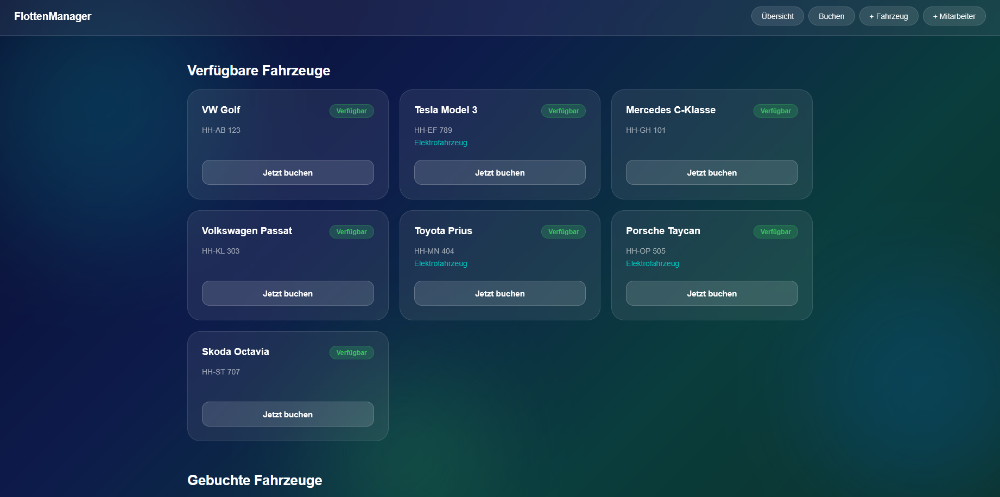
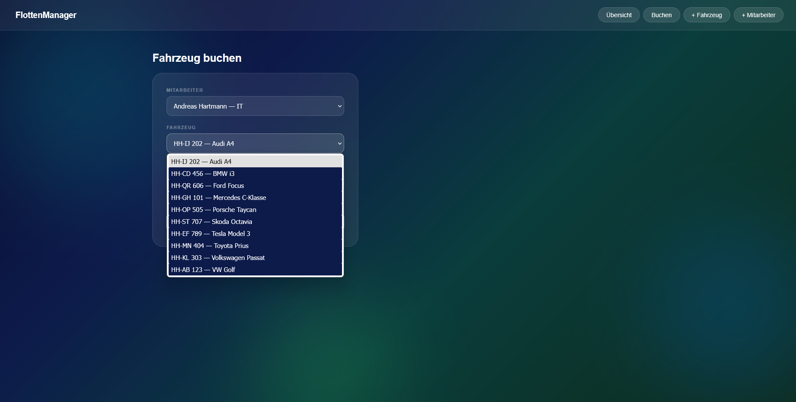
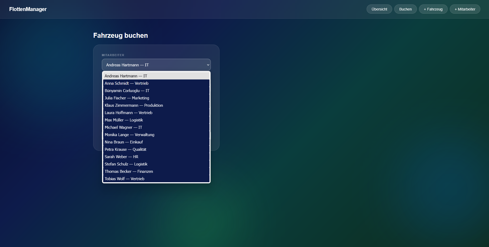
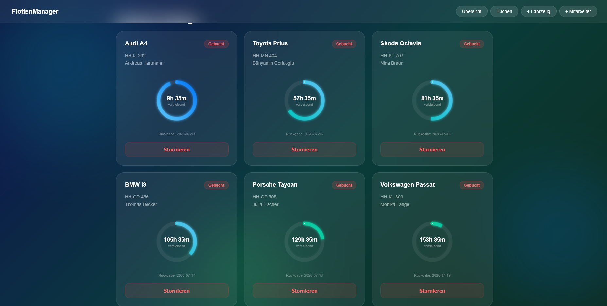
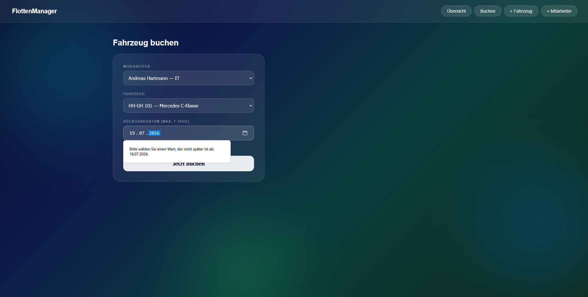

# FlottenManager

Eine Java-Anwendung zur Verwaltung von Firmenfahrzeugen, Mitarbeitern und Fahrzeugbuchungen. Die Daten werden dauerhaft in einer MariaDB-Datenbank gespeichert.

Das Projekt enthält sowohl eine Konsolenanwendung als auch eine browserbasierte Oberfläche mit Jakarta Servlets.

## Funktionen

- Fahrzeuge anzeigen und hinzufügen
- Elektrofahrzeuge kennzeichnen
- Mitarbeiter verwalten
- verfügbare Fahrzeuge buchen
- aktive Buchungen anzeigen und stornieren
- Rückgabezeit visuell darstellen
- abgelaufene Buchungen automatisch beenden
- Daten dauerhaft in MariaDB speichern

## Verwendete Technik

- Java
- Jakarta Servlet API
- MariaDB
- MariaDB JDBC-Treiber
- Apache Tomcat
- HTML und CSS innerhalb des Servlets

## Voraussetzungen

Für die Konsolenanwendung werden benötigt:

- Java
- MariaDB oder MySQL
- eine Datenbank namens `flottenmanager`
- MariaDB auf Port `3307`

Für die Weboberfläche wird zusätzlich ein Server benötigt, der Jakarta Servlets unterstützt, beispielsweise Apache Tomcat 10.1 oder neuer.

Der in älteren XAMPP-Versionen enthaltene Tomcat verwendet möglicherweise noch `javax.servlet` und ist dann nicht mit dem vorhandenen Jakarta-Code kompatibel.

## Datenbankverbindung

Standardmäßig verwendet die Anwendung folgende lokale Einstellungen:

```text
Adresse:  jdbc:mariadb://localhost:3307/flottenmanager
Benutzer: root
Passwort: leer
```

Die Werte können optional über Umgebungsvariablen überschrieben werden:

```text
FLOTTEN_DB_URL
FLOTTEN_DB_USER
FLOTTEN_DB_PASSWORD
```

Dadurch müssen persönliche Zugangsdaten nicht im Quellcode gespeichert werden.

## Konsolenanwendung kompilieren

Vom Projektordner aus:

```powershell
javac -cp "lib/*" Buchung.java DatenbankManager.java Fahrzeug.java Flottenverwaltung.java Main.java Mitarbeiter.java
```

Anschließend kann die Anwendung gestartet werden:

```powershell
java -cp ".;lib/*" Main
```

## Weboberfläche

Die Weboberfläche befindet sich in `FlottenServlet.java`. Sie bietet eine grafische Übersicht über verfügbare und gebuchte Fahrzeuge sowie Formulare zum Anlegen und Buchen von Fahrzeugen.

Für den Betrieb muss das Servlet mit Jakarta Servlet API und einem kompatiblen Tomcat-Server bereitgestellt werden.

## Projektstruktur

```text
FlottenManager/
├── Buchung.java
├── DatenbankManager.java
├── Fahrzeug.java
├── FlottenServlet.java
├── Flottenverwaltung.java
├── Main.java
├── Mitarbeiter.java
├── lib/
├── .gitignore
├── LICENSE
└── README.md
```

## Hinweis zur Veröffentlichung

GitHub Pages kann nur statische Webseiten ausliefern. Da dieses Projekt Java, Tomcat und MariaDB benötigt, kann die Webanwendung nicht direkt über GitHub Pages betrieben werden.

Das öffentliche GitHub-Repository dokumentiert den Quellcode und die Entwicklung des Projekts. Für eine öffentlich erreichbare Live-Version wäre später ein Java-Server mit Datenbank erforderlich.

## Screenshots

### Fahrzeugübersicht



### Fahrzeugauswahl



### Mitarbeiterauswahl



### Buchungsfortschritt



### Eingabevalidierung

